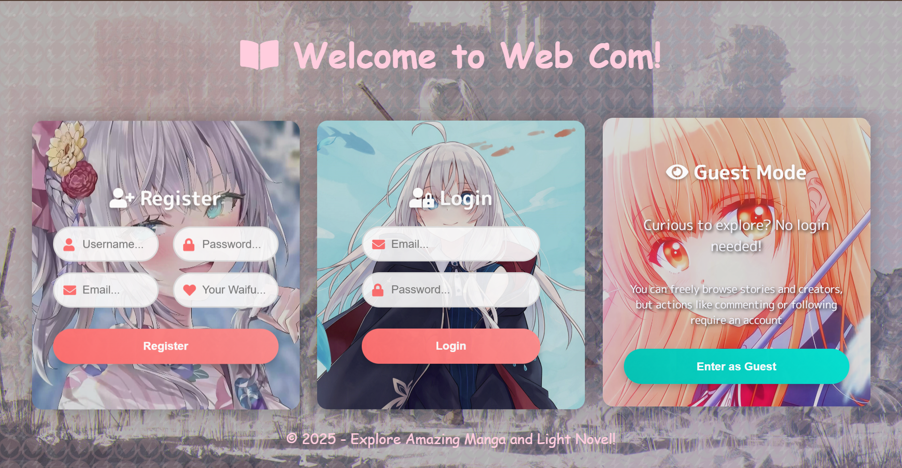
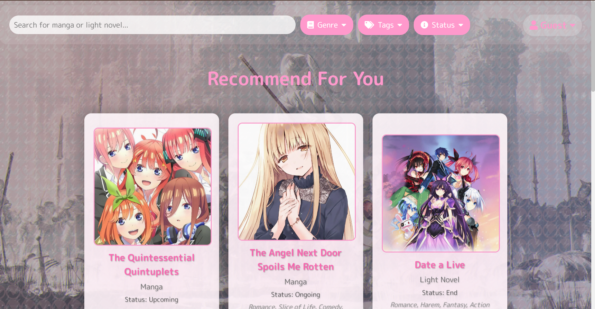
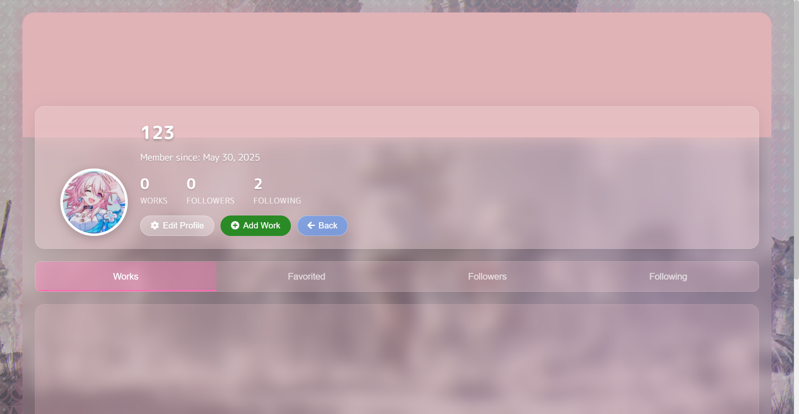
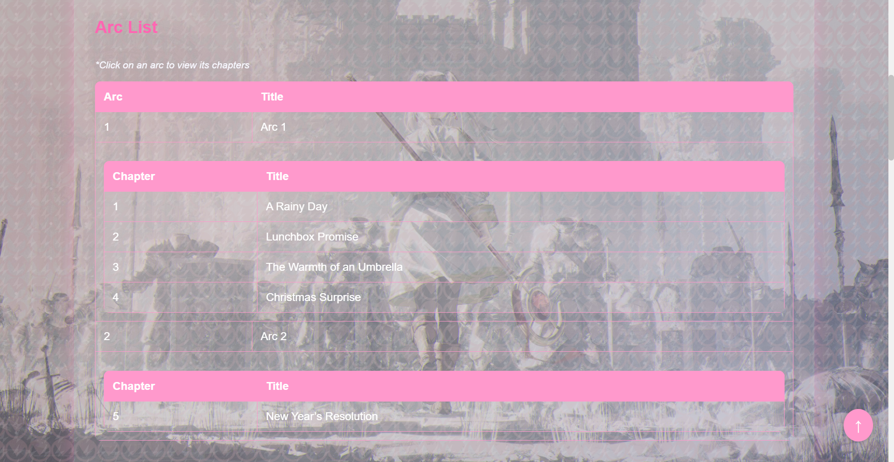
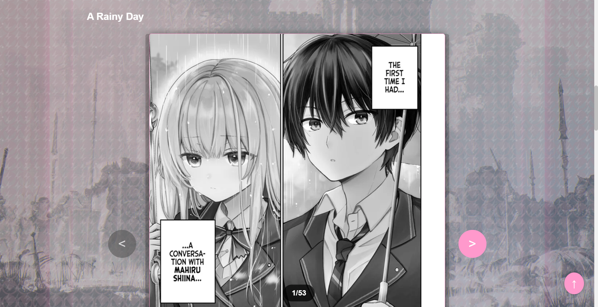
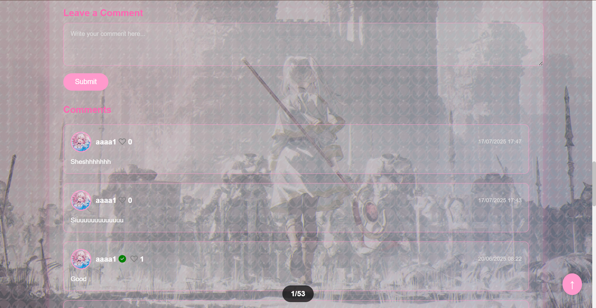

# 📚 Web_Com — Nền tảng truyện tranh mang phong cách Nhật Bản

**Web_Com** là một trang web cộng đồng dành cho người yêu truyện tranh, nơi người dùng có thể đăng tải câu chuyện của bản thân và khám phá những tác phẩm từ người khác. Giao diện đậm chất Nhật với sắc hồng hoa anh đào tạo nên trải nghiệm dễ chịu, cuốn hút.

> ✨ Không cần đăng ký vẫn có thể đọc truyện, tuy nhiên một số tính năng nâng cao như theo dõi tác giả hoặc bình luận sẽ yêu cầu đăng nhập.

---

## 🌸 Trải nghiệm người dùng

Giao diện thiết kế theo phong cách Nhật Bản: nhẹ nhàng, hài hoà, có phần tinh tế nhưng vẫn mang nét hiện đại. Giao diện chính hỗ trợ đăng ký, đăng nhập, chế độ khách và các truyện nổi bật.

### 🖼️ Giao diện chính



### 📖 Giao diện trang danh sách truyện
Trang danh sách truyện là nơi người dùng có thể duyệt các bộ manga hoặc light novel được đề xuất theo sở thích.
Giao diện hỗ trợ **tìm kiếm theo từ khóa, lọc theo thể loại, nhãn (tag), và trạng thái truyện.**
Một số truyện nổi bật được hiển thị: **The Quintessential Quintuplets, The Angel Next Door Spoils Me Rotten và Date a Live**, mang đến trải nghiệm phong phú ngay từ lần đầu truy cập.



### 👤 Giao diện trang cá nhân người dùng
Trang cá nhân cho phép người dùng thể hiện danh tính và hoạt động của mình như: số lượng truyện đã đăng, lượt theo dõi và người đang theo dõi.
Giao diện hỗ trợ **chỉnh sửa hồ sơ, xem lại các tác phẩm, xem danh sách đã yêu thích**, và đặc biệt là có thể **truy cập trang cá nhân của người khác**, giúp tạo tính tương tác cộng đồng.



### 📚 Giao diện chọn chương truyện
Trang “Danh sách Arc & Chương” giúp người đọc dễ dàng chọn phần truyện muốn theo dõi.
Các chương được nhóm theo từng arc nội dung, ví dụ như “A Rainy Day” hoặc “New Year's Resolution”, kèm tiêu đề chương rõ ràng giúp tăng sự tò mò.
Giao diện màu hồng nhẹ cùng bố cục bảng gọn gàng tạo cảm giác dễ tiếp cận và chuyên nghiệp.
Đây cũng là nơi người dùng có thể quay lại các chương cũ hoặc khám phá toàn bộ truyện một cách tuần tự.



### Giao diện nội dung tác phẩm — Manga & Light Novel
### 📖 Manga
Người dùng khi chọn loại tác phẩm là Manga sẽ được trải nghiệm nội dung theo kiểu trình bày hình ảnh tuần tự — đúng chuẩn truyện tranh Nhật Bản.
Giao diện mô phỏng cảm xúc rõ nét qua từng khung truyện, chẳng hạn như hình ảnh trong chương “A Rainy Day” thể hiện khung cảnh hai nhân vật trò chuyện dưới mưa — vừa nhẹ nhàng, vừa sâu sắc.
Thiết kế giúp người đọc tập trung trọn vẹn vào trải nghiệm hình ảnh và cảm xúc trong từng chương.



### 📘 Light Novel
Với tác phẩm dạng Light Novel, người dùng sẽ được đọc nội dung văn bản đầy đủ theo dạng tiểu thuyết — có tiêu đề chương, phân đoạn, và mô tả chi tiết.
Giao diện hiển thị văn bản rõ ràng, bố cục hợp lý, giúp người đọc theo dõi mạch truyện mượt mà và dễ tiếp thu nội dung sâu hơn.
Đây là cách tuyệt vời để hỗ trợ những bạn yêu thích truyện có chiều sâu nội dung và lời thoại chân thật.


### 💬 Giao diện bình luận truyện
Phần bình luận là nơi người đọc thỏa sức trao đổi cảm xúc, bày tỏ ý kiến và kết nối với những độc giả khác.
Giao diện được thiết kế mang sắc hồng dễ thương, cùng hình nền truyện sinh động, tạo không khí sôi nổi nhưng vẫn ấm áp.
Người dùng có thể viết phản hồi trực tiếp, trả lời người khác, hoặc đơn giản là thả vài câu như “Siuuuu” để lan toả năng lượng tích cực trong cộng đồng.



---

## 🚀 Tính năng nổi bật

- 📖 Đọc truyện của người khác
- ✍️ Đăng tải truyện cá nhân
- 👥 Theo dõi tác giả yêu thích
- 💬 Bình luận các tác phẩm
- 🔓 Chế độ khách đọc truyện không cần tài khoản
- 🎌 Giao diện lấy cảm hứng từ văn hoá Nhật Bản

---

## 🛠 Công nghệ sử dụng

- C# (ASP.NET MVC)
- Entity Framework
- SQL Server
- HTML / CSS / JavaScript

---

## 🔧 Cách chạy dự án

```bash
git clone https://github.com/USERNAME/Web_Com.git
Mở Web_Com.sln bằng Visual Studio
Đi đến thư mục Web_com/Views/Home
Nhấn F5 để chạy và bắt đầu trải nghiệm
```

---

## 📁 Cấu trúc thư mục

| Thư mục / Tệp                   | Mô tả                             |
|----------------------------------|-----------------------------------|
| `Web_com/Controllers`            | Xử lý tương tác người dùng        |
| `Web_com/Models`                 | Định nghĩa các model dữ liệu      |
| `Web_com/Views/Home`             | Giao diện chính                   |
| `Web_com/DatabaseScripts`        | Các file SQL tạo bảng / dữ liệu   |
| `Content/Images/Preview`         | Ảnh minh hoạ giao diện            |

---

## 🔒 Thông tin repo

Repo hiện đang ở chế độ công khai. Mọi người đều có thể xem mã nguồn, nhưng chỉ chủ sở hữu hoặc cộng tác viên được cấp quyền mới có thể chỉnh sửa. Người dùng khác có thể gửi pull request để đề xuất thay đổi.

----

## 👤 Tác giả

- Nickname: White Queen
- Dự án cá nhân kết hợp niềm đam mê lập trình & truyện tranh

💬 Hiện tại dự án vẫn đang trong quá trình hoàn thiện. Nếu bạn thấy dự án thú vị hoặc có đề xuất nâng cấp tính năng, đừng ngại mở issue hoặc liên hệ nhé!
-------------------------------------------------------


# [Global version]
# 📚 Web_Com — Manga-Inspired Comic Platform

**Web_Com** is a web-based platform where users can publish original comic stories and explore creations from others. With a soothing cherry-blossom-themed interface, it reflects the aesthetic spirit of Japanese manga while promoting community-driven storytelling.

> ✨ Reading doesn’t require signing up — but features like commenting and following authors are available for registered users.

---

## 🌸 User Experience

Clean and culturally inspired interface offering login, guest access, and a welcoming homepage full of stories and featured creators.

### 🖼️ Homepage Preview


### 📖 Story Listing Interface
This page lets users explore a curated list of recommended manga and light novels.
Features include a **keyword search bar, genre filter, tag selector, and status-based filtering**.
Highlighted titles include **The Quintessential Quintuplets, The Angel Next Door Spoils Me Rotten, and Date a Live** — making it easy for new users to dive in.


### 👤 User Profile Interface
The profile page showcases a user's identity and engagement statistics, including works published, number of followers, and following count.
Users can **edit their profile, view their uploaded comics, access favorited items**, and even **visit other users’ profiles** — promoting community interaction and connection.


### 📚 Chapter Selection Interface
The "Arc & Chapter List" page provides a smooth, organized way to browse through story content.
Chapters are grouped by narrative arcs like “A Rainy Day” or “New Year's Resolution”, each clearly titled to spark curiosity.
The soft pink styling and structured table layout enhance readability and deliver a clean, user-friendly experience.
This interface also allows readers to revisit previous episodes or explore the story chronologically.


### Story Content Interface — Manga & Light Novel Formats
### 📖 Manga 
When a story is categorized as Manga, users will experience the content as sequential illustrated panels — mirroring traditional Japanese comic styles.
Emotional depth is expressed through each frame. For example, the “A Rainy Day” chapter beautifully captures two characters connecting under the rain — subtle, reflective, and atmospheric.
This layout ensures readers are immersed visually and emotionally throughout each chapter.


### 📘 Light Novel Format
For Light Novels, content is presented as structured narrative text, with clear chapter titles, paragraphs, and scene descriptions.
The interface provides a clean reading experience with well-organized formatting — ideal for users who enjoy deeper storytelling and dialogue-driven plots.
It's a great choice for readers who appreciate literary flow and emotional nuance.


### 💬 Comment Section
A vibrant hub where readers can react, share feelings, and engage with other manga enthusiasts.
The cheerful pink-toned interface with dynamic background imagery sets a friendly and energetic tone.
Comments range from expressive cheers like “Siuuuuuu” to heartfelt feedback, making the environment welcoming and playful.


---

## 🚀 Key Features

- 📖 Browse and read user-generated comics
- ✍️ Publish your own stories
- 👥 Follow favorite authors
- 💬 Comment and interact with stories
- 🔓 Read freely in guest mode
- 🎌 Interface styled after Japanese manga culture

---

## 🧰 Technologies Used

- C# (ASP.NET MVC)
- Entity Framework
- SQL Server
- HTML / CSS / JavaScript

---

## 🔧 How to Run the Project

```bash
git clone https://github.com/USERNAME/Web_Com.git
Open Web_Com.sln using Visual Studio
Go to Web_com/Views/Home
Press F5 to launch the site
```

---

## 📁 Folder Structure

| Folder / File                  | Description                         |
|--------------------------------|-------------------------------------|
| `Web_com/Controllers`          | Handles user actions & navigation   |
| `Web_com/Models`               | Defines app data models             |
| `Web_com/Views/Home`           | Main homepage interface             |
| `Web_com/DatabaseScripts`      | SQL scripts for database setup      |
| `Content/Images/Preview`       | Interface screenshots               |

---

## 🔒 Repository Info

This repository is now public.  
Anyone may explore and fork the code, but only collaborators or the owner can directly make changes. Contributions may be made through pull requests.

---

## 👤 Author

- Nickname: White Queen
- A personal project blending love for manga and software development

💬 Currently the project is still in the process of completion. If you find the project interesting or have a suggestion for feature upgrades, don't hesitate to open an issue or reach out!
---
